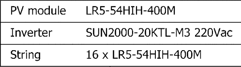

# Design and Analysis of a 50kW Grid-Connected Solar PV System in Purba Amritnagar, Chitwan, Nepal

## Table of Contents

1. [Abstract](#1-abstract)
2. [Introduction](#2-introduction)
3. [Background](#3-background)
   - [3.1 Solar Energy and Photovoltaic Technology](#31-solar-energy-and-photovoltaic-technology)
   - [3.2 Components of a Grid-Connected Solar PV System](#32-components-of-a-grid-connected-solar-pv-system)
   - [3.3 System Configuration](#33-system-configuration)
4. [Methodology](#4-methodology)
   - [4.1 Site Selection](#41-site-selection)
   - [4.2 Data Collection](#42-data-collection)
   - [4.3 Simulation Tools](#43-simulation-tools)
5. [System Design](#5-system-design)
   - [5.1 PV Module and Inverter Selection](#51-pv-module-and-inverter-selection)
   - [5.2 Loss Parameters](#52-loss-parameters)
   - [5.3 System Configuration](#53-system-configuration)
6. [Simulation and Analysis](#6-simulation-and-analysis)
   - [6.1 Tilt and Pitch Optimization](#61-tilt-and-pitch-optimization)
   - [6.2 Performance Evaluation](#62-performance-evaluation)
   - [6.3 Loss Analysis](#63-loss-analysis)
7. [Results and Discussion](#7-results-and-discussion)
   - [7.1 Simulation Results](#71-simulation-results)
   - [7.2 Practical Implications](#72-practical-implications)
   - [7.3 Future Work](#73-future-work)
8. [Conclusion](#8-conclusion)
9. [References](#9-references)

## 1. Abstract

The study aims to design and analyze a 50kW grid-connected solar PV system in Purba Amritnagar, Chitwan, Nepal, using PVSyst software, evaluate its performance, and assess its environmental benefits.

## 2. Introduction

Solar photovoltaic systems, made of semiconductor materials (e.g., silicon), convert sunlight directly into electricity. With technological advancements and declining costs, solar systems are emerging as the most viable sustainable energy source. After hydropower, solar PV systems will be a vital component of the country's energy strategy. To reduce dependency on fossil fuels, grid-connected solar PV systems are widely used. Integrating these systems into existing power grids is important for enhancing energy security, reducing electricity costs through net metering, and helping cut greenhouse gas emissions, thereby contributing to a cleaner environment and supporting SDG goals. Nepal has great potential for some type of solar energy technologies such as: grid connected PV, Solar Water Heaters, Solar Lanterns and solar home systems. Nepal is well-suited for PV systems due to its high solar insolation levels of 4.5 to 5.5 kWh/m²/day with roughly 300 days of sun a year making it ideal for commercial solar projects. Here, the study aims to design and analyze a 50kW grid-connected solar PV system in Purba Amritnagar, Chitwan, Nepal, using PVSyst software, evaluate its performance, and assess its environmental benefits.

## 3. Background

### 3.1. Solar Energy and Photovoltaic Technology

As the world is seeking cleaner and more sustainable methods of energy production, solar energy has become the focus. The widespread adoption of solar energy is reducing the dependency on fossil fuels, mitigating greenhouse gas emissions, and contributing to the global effort against climate change. Solar cells or photovoltaic cells can sunlight directly into electricity. These PV cells can be installed on various scales, from small household installations to large-scale solar farms that feed power into the grid.

### 3.2. Components of a Grid-Connected Solar PV System

The basic unit of solar energy production is the solar cell. When multiple solar cells are combined and framed, they form a solar panel or module. These modules can be interconnected in series to form a string, and multiple strings can be connected in parallel to create a solar array. The connections in series or parallel determine the voltage, current, and overall power output of the system. The solar array produces direct current (DC) electricity, which must be converted to alternating current (AC) electricity for grid integration. We can achieve this conversion through a solar inverter. Modern inverters have advanced functionalities such as Maximum Power Point Tracking (MPPT), which optimizes the power output of the PV system by continuously adjusting the operating point of the modules. Modern inverters allow real-time tracking of energy production and system performance. Another essential component in a grid-connected PV system is the net meter. When the solar panels produce more electricity than is used, the excess is fed back into the grid, and the owner receives a credit.

### 3.3. System Configuration

The proposed solar photovoltaic (PV) power system includes several key components to ensure efficient operation. It features an array of solar PV panels, an inverter, electrical connections, a sturdy support framework, safety components, energy storage units, and decentralized control systems. The following diagram provides a visual representation of how these elements are arranged and interconnected within the system.

## 4. Methodology

### 4.1. Site Selection

Selection of solar PV plant sites requires careful consideration of several factors like: site's accessibility via roads, the availability of power evacuation facilities, the local climate, the level of solar irradiance, and the risk of flooding. Additionally, it is essential to plan for the installation of the panels, the construction of a control building, and the overall safety of the plant. In this context, sites have been selected in Manipur, Nepal. These locations, situated at a latitude of 27.60°N and a longitude of 84.31°E with an altitude of 163 meters, have been chosen for their optimal solar irradiation and suitability for solar energy generation. The albedo for these sites is 0.20, ensuring that all necessary criteria for the plant's performance and longevity are met.

### 4.2. Data Collection

Meteorological data for this project was sourced from the Meteonorm 8.1 database, covering the years 1996 to 2015. The annual energy yield of a PV plant is heavily dependent on the solar resource of the site. In the absence of a dedicated weather station to obtain solar radiation data, information has been gathered from various sources, with a strong emphasis on data provided by the Global Solar Atlas.

### 4.3. Simulation Tools

**PVSyst**: PVSyst is a software tool used for the design, simulation, and analysis of solar PV systems. It allows for the detailed modeling of various components and configurations of PV systems.

**MATLAB**: MATLAB is a high-level programming environment used for advanced data analysis, algorithm development, and modeling.

## 5. System Design

The system configuration for the solar PV plant includes several critical components and parameters to ensure optimal performance and energy yield. The system is designed with a grid-connected configuration and consists of the following elements:

### 5.1. PV Module and Inverter Selection

- **PV Modules**:
  - Manufacturer: Longi Solar
  - Model: LR5-54HIH-400M
  - Unit Nominal Power: 400 Wp
  - Total Number of Modules: 128
  - Total Nominal Power: 51.2 kWp
  - Module Arrangement: 8 strings, each with 16 modules connected in series

- **Inverters**:
  - Manufacturer: Huawei Technologies
  - Model: SUN2000-20KTL-M3 220Vac
  - Unit Nominal Power: 20 kWac
  - Total Number of Inverters: 2
  - Total Inverter Power: 40 kWac
  - DC to AC Power Ratio: 1.28

### 5.2. Loss Parameters

- **Array Soiling Losses**: 1.0%
- **Thermal Loss Factor**: Uc (20.0 W/m²K), Uv (0.0 W/m²K/m/s)
- **DC Wiring Losses**: 1.5% at STC
- **Module Quality Loss**: -0.4%
- **Module Mismatch Losses**: 2.0% at MPP
- **Strings Mismatch Loss**: 0.1%
- **Module Average Degradation**: 0.4% per year over 25 years

### 5.3. System Configuration

- **PV Field Orientation**:
  - Type: Fixed plane
  - Tilt Angle: 25°
  - Azimuth Angle: 0°

- **Shading and Spacing**:
  - Number of Sheds: 16
  - Collector Width: 3.46 meters
  - Sheds Spacing: 5.00 meters
  - Ground Coverage Ratio (GCR): 69.3%
  - Shading Limit Angle: 38.3°

- **Energy Production**:
  - Produced Energy: 61,146 kWh/year
  - Specific Production: 1194 kWh/kWp/year
  - Performance Ratio (PR): 70.09%

This configuration ensures that the solar PV plant is optimized for maximum energy production and efficiency. The chosen components and their arrangement are designed to minimize losses and maximize the output of the solar PV system, providing a reliable and sustainable energy source.

## 6. Simulation and Analysis

### 6.1. Tilt and Pitch Optimization

Tilt and pitch optimization are crucial for maximizing the energy output of the solar PV system. Using PVSyst, a range of tilt and pitch angles were simulated to determine the optimal configuration. The simulation is done for the tilt of 28° to give maximum output. The optimal pitch distance is taken as 5.00 meters between rows, which minimizes shading and maximizes the use of available space.

## 7. Results 

### 7.1. Performance Evaluation

A performance evaluation of the solar PV system was conducted using PVSyst, which provided detailed insights into the system’s annual energy yield, performance ratio, and specific energy production. The performance ratio is a measure of the quality of a PV plant that is independent of location and is therefore often described as a quality factor. The performance ratio (PR) is stated as percent and describes the relationship between the actual and theoretical energy outputs of the PV plant. PR is found to be 70.09%. The total system production is 61,146 kWh/year. The specific energy production is 1194 kWh/kWp/year reflecting the effectiveness of the installed capacity.

Figure: Performance Evaluation 

Figure: System Production 

### 6.3. Loss Analysis

System efficiency is affected by various environmental factors. Hence, loss analysis is essential to understand and mitigate the factors that reduce the overall efficiency of the solar PV system.

### 7.1. Simulation Results

- **Monthly and Annual Energy Output**: Detailed results of energy output on a monthly and annual basis.
- **Performance Ratio and Capacity Factor**: Analysis of the performance ratio and capacity factor of the system.

## 8. Conclusion

The design and analysis of a 50 kW grid-connected solar PV system in Purba Amritnagar, Chitwan, Nepal, using PVSyst software demonstrates the substantial potential for solar energy in the region. The careful selection of components, optimization of tilt and pitch angles, and thorough performance evaluation highlight the efficiency and reliability of the system. With an annual energy production of 61,146 kWh and a performance ratio of 70.09%, this solar PV installation exemplifies a significant step towards sustainable energy solutions. Clean energy from the solar PV system significantly contributes to reducing CO₂ emissions compared to conventional energy sources. Over its 30-year lifetime, accounting for an annual degradation of 1.0%, the system effectively reduces CO₂ emissions by a substantial margin. The cumulative net savings are approximately -19,867.4 kgCO₂, reflecting the positive environmental impact of the solar PV installation. The project illustrates that with the right technology and careful planning, solar energy can play a pivotal role in meeting the country's energy demands while fostering a cleaner, greener future.

## 9. References

- Radhi, M. H., Mahdi, E. J., & Mftwol, A. K. (2019, April). Design and performance analysis of solar PV system size 2.56 kWp. In 2019 4th scientific international conference Najaf (SICN) (pp. 70-73). IEEE.
- Monu, T., & Vadhera, S. (2023, January). Optimum Tilt-Pitch Analysis and Design of 25kW Grid Connected Solar PV System using PVSyst Software. In 2023 International Conference for Advancement in Technology (ICONAT) (pp. 1-4). IEEE.
- Ali, A., Shah, F., Khan, M., & Mehmood, F. (2019, February). Design & Analysis of Solar PV System for Sarhad University Peshawar. In 2019 International Conference on Engineering and Emerging Technologies (ICEET) (pp. 1-6). IEEE.
- Parmar, J. (2023, September). Design, Simulation, and Analysis of 100kW Commercial Solar PV System in India. In 2023 3rd International Conference on Energy, Power and Electrical Engineering (EPEE) (pp. 90-95). IEEE.